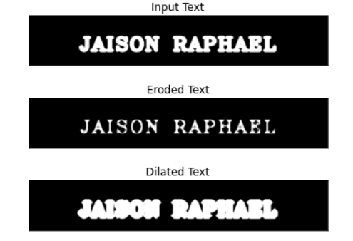

# Implementation-of-Erosion-and-Dilation
## Aim
To implement Erosion and Dilation using Python and OpenCV.
## Software Required
1. Anaconda - Python 3.7
2. OpenCV
## Algorithm:
### Step1:
Import the necessary packages.

### Step 2:
Create the Text using cv2.putText.

### Step 3:
Create the structuring element.

### Step 4:
Erode the image.

### Step 5:
Dilate the image.
## Program:

``` Python

# Import the necessary packages

import numpy as np
import cv2
import matplotlib.pyplot as plt

# Load the Image

img1=np.zeros((100,600),dtype='uint8')
font=cv2.FONT_HERSHEY_COMPLEX_SMALL

# Create the Text using cv2.putText

cv2.putText(img1,'    JAISON RAPHAEL    ',(5,70),font,2,(255),5,cv2.LINE_AA)
plt.imshow(img1,cmap='gray')
plt.title('Input Text'), plt.xticks([]), plt.yticks([])
plt.show()

# Create the structuring element

kernel1=cv2.getStructuringElement(cv2.MORPH_CROSS,(7,7))

# Erode the image

img_erode=cv2.erode(img1,kernel1)
plt.imshow(img_erode,cmap='gray')
plt.title('Eroded Text'), plt.xticks([]), plt.yticks([])
plt.show()

# Dilate the image

img_dilate=cv2.dilate(img1,kernel1)
plt.imshow(img_dilate,cmap='gray')
plt.title('Dilated Text'), plt.xticks([]), plt.yticks([])
plt.show()

```
## Output:



## Result
Thus the generated text image is eroded and dilated using python and OpenCV.